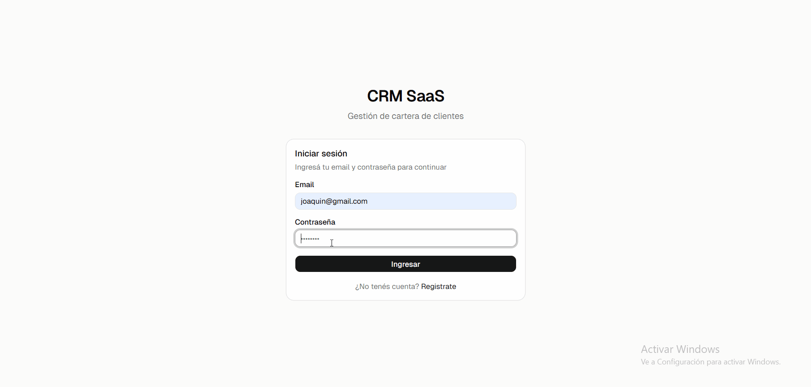
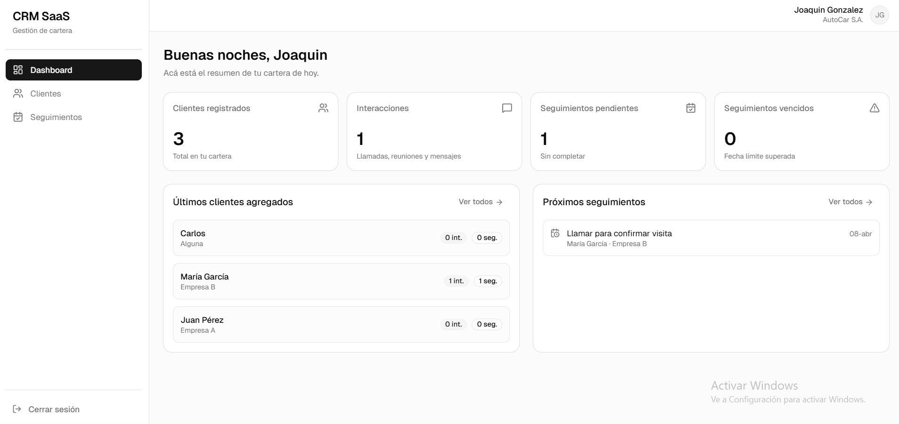
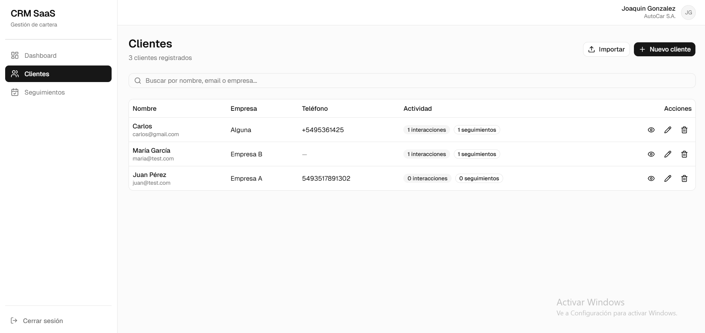

# CRM SaaS — Frontend

Interfaz web para la plataforma de gestión de cartera de clientes. Permite a ejecutivos de ventas registrar clientes, historial de interacciones, seguimientos y ver un dashboard con estadísticas de su actividad.

---

## Demo



## Screenshots




---

## Features

- Autenticación completa con JWT
- Dashboard con métricas en tiempo real
- Gestión de clientes (CRUD + búsqueda con debounce)
- Historial de interacciones por cliente
- Seguimientos con estados (pendiente, vencido, completado)
- Importación masiva desde CSV/XLSX
- Manejo global de estado con TanStack Query
- Interceptores HTTP para manejo automático de sesión

---

## Tecnologías

- **Next.js 15** — framework React con App Router
- **TypeScript** — tipado estático en todo el proyecto
- **Tailwind CSS** — estilos utilitarios
- **shadcn/ui** — componentes de UI accesibles y personalizables
- **TanStack Query** — manejo de estado del servidor, caché y sincronización
- **Axios** — cliente HTTP con interceptores para JWT
- **Lucide React** — iconos

---

## Requisitos previos

- Node.js v18 o superior
- El backend corriendo en `http://localhost:3001`
- npm

---

## Instalación

```bash
# Clonar el repositorio
git clone https://github.com/SBSofiaBartoli/crm-saas-frontend.git
cd crm-saas-frontend

# Instalar dependencias
npm install

# Configurar variables de entorno
cp .env.local.example .env.local
# Editar .env.local con la URL del backend
```

## Correr el proyecto

```bash
npm run dev

```

La app queda disponible en `http://localhost:3000`

---

## Variables de entorno

Creá un archivo `.env.local` en la raíz del proyecto:

```env
NEXT_PUBLIC_API_URL=http://localhost:3001/api
```

| Variable              | Descripción                    |
| --------------------- | ------------------------------ |
| `NEXT_PUBLIC_API_URL` | URL base de la API del backend |

El prefijo `NEXT_PUBLIC_` es requerido por Next.js para exponer la variable al código del cliente (browser).

---

## Estructura del proyecto

```
src/
├── app/
│   ├── (auth)/               # Rutas públicas sin layout de dashboard
│   │   ├── login/            # Página de inicio de sesión
│   │   └── register/         # Página de registro
│   └── (dashboard)/          # Rutas protegidas con sidebar y header
│       ├── layout.tsx         # Layout compartido con Sidebar y Header
│       ├── dashboard/         # Panel principal con estadísticas
│       ├── clients/           # Lista y detalle de clientes
│       │   └── [id]/          # Detalle individual con interacciones y seguimientos
│       └── follow-ups/        # Seguimientos pendientes globales
├── components/
│   ├── ui/                   # Componentes shadcn/ui (auto-generados)
│   ├── auth/                 # LoginForm y RegisterForm
│   ├── layout/               # Sidebar y Header
│   ├── clients/              # ClientsView, ClientTable, ClientForm, ClientDetail, ImportModal
│   ├── interactions/         # InteractionList e InteractionForm
│   ├── follow-ups/           # FollowUpList, FollowUpForm y FollowUpsView
│   └── dashboard/            # DashboardView, StatsCards, RecentClients, UpcomingFollowUps
├── hooks/                    # React Query hooks por entidad
│   ├── useAuth.ts
│   ├── useClients.ts
│   ├── useInteractions.ts
│   ├── useFollowUps.ts
│   ├── useDashboard.ts
│   └── useDebounce.ts
├── lib/
│   ├── axios.ts              # Cliente HTTP con interceptores JWT
│   ├── auth.ts               # Helpers para localStorage (token y usuario)
│   └── utils.ts              # Utilidades de shadcn
├── providers/
│   └── query-provider.tsx    # Configuración global de TanStack Query
└── types/                    # Interfaces TypeScript por entidad
    ├── auth.types.ts
    ├── client.types.ts
    ├── interaction.types.ts
    ├── follow-up.types.ts
    ├── dashboard.types.ts
    ├── user.types.ts
    └── index.ts              # Re-exporta todo
```

---

## Páginas

| Ruta           | Descripción                                                         |
| -------------- | ------------------------------------------------------------------- |
| `/login`       | Inicio de sesión                                                    |
| `/register`    | Registro de nuevo ejecutivo                                         |
| `/dashboard`   | Panel principal con métricas y actividad reciente                   |
| `/clients`     | Lista de clientes con búsqueda e importación                        |
| `/clients/:id` | Detalle del cliente con interacciones y seguimientos                |
| `/follow-ups`  | Todos los seguimientos pendientes separados por vencidos y próximos |

---

## Funcionalidades principales

**Autenticación**

- Registro con nombre, email, contraseña, teléfono y empresa
- Login con redirección automática al dashboard
- Token JWT guardado en localStorage
- Cierre de sesión desde el sidebar
- Redirección automática al login cuando el token expira (interceptor de axios)

**Gestión de clientes**

- Listado con búsqueda en tiempo real (debounce de 400ms)
- Crear y editar clientes desde un modal
- Eliminar con confirmación
- Importar masivamente desde archivos CSV o Excel con reporte de errores por fila
- Ver detalle completo con historial de interacciones y seguimientos

**Interacciones**

- Registrar llamadas, reuniones y mensajes con fecha y resumen
- Historial ordenado por fecha descendente
- Eliminar interacciones del historial

**Seguimientos**

- Crear recordatorios con descripción y fecha límite
- Marcar como completado con tachado visual
- Estado visual: pendiente, vencido (en rojo), completado
- Vista global de todos los pendientes agrupados por vencidos y próximos

**Dashboard**

- Saludo personalizado según la hora del día
- 4 métricas: clientes totales, interacciones, seguimientos pendientes y vencidos
- Alerta visual cuando hay seguimientos vencidos
- Últimos 5 clientes agregados con acceso rápido
- Próximos 5 seguimientos con indicador de urgencia

---

## Decisiones técnicas destacadas

**Separación de páginas y lógica**
Las páginas de Next.js son Server Components por defecto. Toda la lógica de estado e interactividad vive en componentes `'use client'` separados (`ClientsView`, `DashboardView`, etc.) que la página simplemente importa y renderiza. Esto mantiene las páginas limpias y permite que Next.js optimice el rendering.

**TanStack Query para estado del servidor**
En lugar de manejar loading, error y datos con `useState` + `useEffect` en cada componente, TanStack Query centraliza ese manejo con caché automático. Cuando se crea o modifica un cliente, `invalidateQueries` refresca automáticamente todos los datos relacionados sin necesidad de recargar la página.

**Debounce en búsqueda**
La búsqueda de clientes usa un debounce de 400ms para evitar una llamada al backend por cada tecla. El usuario tipea libremente y la búsqueda se dispara cuando deja de escribir.

**`key` prop para resetear formularios**
En lugar de usar `useEffect` para resetear el estado del formulario cuando cambia el cliente a editar, se pasa una `key` diferente al componente. Cuando la `key` cambia React destruye y remonta el componente, reseteando el estado automáticamente. Es el patrón recomendado por React para este caso.

**Interceptores de axios**
El cliente HTTP tiene dos interceptores: uno de request que agrega automáticamente el token JWT a cada llamada, y uno de response que detecta errores 401 y redirige al login limpiando el storage. Sin esto habría que manejar el token manualmente en cada llamada.

---

## Roadmap v2

- Protección de rutas con middleware de Next.js (actualmente la redirección es client-side)
- Modo oscuro
- Gráfico de interacciones por tipo en el dashboard
- Notificaciones en el browser para seguimientos próximos a vencer
- Página de perfil del ejecutivo para editar sus datos

---

## Backend

El backend de este proyecto está en un repositorio separado:
[crm-saas-backend](https://github.com/SBSofiaBartoli/crm-saas-backend)
